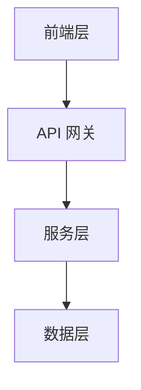
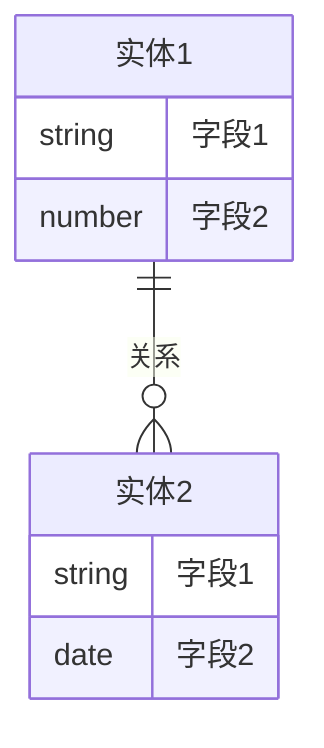

# 架构设计文档

## 文档信息
- **项目名称**：[项目名称]
- **文档版本**：[版本号]
- **状态**：[草稿/审核中/已批准]
- **作者**：[作者]
- **最后更新**：[日期]

## 系统概述
### 项目背景
[简要描述项目背景和目标]

### 架构目标
- [目标 1]
- [目标 2]
- [目标 3]

## 系统架构
### 整体架构


### 技术栈选择
#### 前端技术
- 框架：[框架名称]
- UI 库：[库名称]
- 状态管理：[方案名称]

#### 后端技术
- 语言：[编程语言]
- 框架：[框架名称]
- 中间件：[中间件列表]

#### 数据库
- 主数据库：[数据库名称]
- 缓存：[缓存方案]
- 数据备份：[备份策略]

## 详细设计
### 模块划分
1. [模块 1]
   - 功能职责
   - 接口定义
   - 数据流向

2. [模块 2]
   - 功能职责
   - 接口定义
   - 数据流向

### API 设计
#### REST API
```yaml
/api/v1/resource:
  get:
    description: 获取资源
    parameters: [...]
    responses: [...]
  post:
    description: 创建资源
    parameters: [...]
    responses: [...]
```

### 数据模型


## 安全设计
### 认证授权
- 认证方案：[方案描述]
- 授权策略：[策略描述]
- 密钥管理：[管理方式]

### 数据安全
- 传输加密：[加密方案]
- 存储加密：[加密方案]
- 敏感数据处理：[处理方案]

## 性能设计
### 性能目标
- 响应时间：[目标值]
- 并发处理：[目标值]
- 系统吞吐量：[目标值]

### 优化策略
- 缓存策略：[描述]
- 负载均衡：[描述]
- 数据库优化：[描述]

## 部署架构
### 环境规划
- 开发环境：[配置]
- 测试环境：[配置]
- 生产环境：[配置]

### 部署流程


## 监控告警
### 监控指标
- 系统指标：[列表]
- 业务指标：[列表]
- 安全指标：[列表]

### 告警策略
- 告警级别：[定义]
- 告警渠道：[列表]
- 响应流程：[描述]

## 灾备方案
### 数据备份
- 备份策略：[描述]
- 恢复流程：[描述]
- RTO/RPO：[目标值]

### 应急预案
- 故障等级：[定义]
- 处理流程：[描述]
- 演练计划：[描述]

## 扩展性设计
### 水平扩展
- 服务扩展：[方案]
- 数据扩展：[方案]

### 垂直扩展
- 性能提升：[方案]
- 功能扩展：[方案]

## 技术风险
### 已识别风险
1. [风险 1]
   - 影响：[描述]
   - 缓解措施：[描述]

2. [风险 2]
   - 影响：[描述]
   - 缓解措施：[描述]

## 附录
### 参考文档
- [文档 1]
- [文档 2]

### 变更记录
| 日期 | 版本 | 变更内容 | 作者 |
|------|------|----------|------|
| [日期] | [版本] | [内容] | [作者] |
