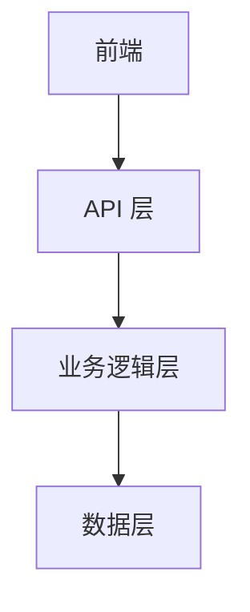

# 产品需求文档（PRD）模板标准

<version>1.0.0</version>

## 要求

- 遵循标准化的产品需求文档结构
- 包含所有必需章节
- 保持适当的文档层次
- 使用一致的格式

## PRD 结构

### 必需章节

#### 1. 文档标题

- 标题："{项目名称}产品需求文档（PRD）"

#### 2. 状态

- 草稿
- 已批准

#### 3. 引言

- {项目名称}的清晰描述
- 项目范围概述
- 业务背景和驱动因素
- 目标用户和利益相关者

#### 4. 目标

- 清晰的项目目标
- 可衡量的成果
- 成功标准
- 关键绩效指标（KPI）

#### 5. 功能和需求

##### 功能性需求
- 核心功能列表
- 用户交互流程
- 系统行为定义

##### 非功能性需求
- 性能要求
- 可扩展性
- 安全性标准
- 可用性

##### 用户体验需求
- 交互设计原则
- 可访问性标准
- 用户界面指南

##### 集成需求
- 外部系统连接
- 数据交换标准
- API 规范

##### 合规性需求
- 法律法规遵守
- 行业标准
- 隐私保护

#### 6. 史诗（Epic）结构

- 至少定义一个史诗
- 格式：史诗-{N}：{标题}（{状态}）
  - 状态可以是：进行中、未来、已完成

## 示例

<example>
# 产品需求文档 (PRD)

## 项目概述
- **项目名称**：Windsurf AI 助手
- **创建日期**：2023-02-20
- **状态**：草稿
- **版本**：1.0.0

## 目标与背景
### 项目目标
Windsurf AI 助手旨在提高开发者的生产力和代码质量。

### 背景信息
Windsurf AI 助手是基于 AI 技术的智能编程辅助工具。

## 功能需求
### 核心功能
1. 上下文感知代码生成
   - 详细描述：根据上下文生成代码
   - 验收标准：代码正确性和可读性
   - 优先级：高

2. 实时代码质量分析
   - 详细描述：实时分析代码质量
   - 验收标准：准确性和实时性
   - 优先级：中

### 可选功能
1. 自动重构建议
   - 详细描述：根据代码质量提供重构建议
   - 验收标准：准确性和实用性
   - 优先级：低

## 技术要求
### 技术栈
- 前端：React
- 后端：Node.js
- 数据库：MongoDB
- 其他：AI 模型

### 系统架构

### 性能要求
- 响应时间：< 1s
- 并发用户：1000
- 数据处理：实时

## 用户界面
### 设计原则
- 简洁易用
- 一致性

### 界面原型
[添加界面原型或链接]

## 安全要求
- 认证方案：OAuth
- 数据加密：AES
- 访问控制：RBAC

## 测试要求
### 测试范围
- 单元测试
- 集成测试
- 性能测试
- 安全测试

### 测试标准
[定义验收测试标准]

## 部署要求
- 环境要求：Linux
- 部署流程：CI/CD
- 监控方案：Prometheus

## 项目时间线
- 阶段 1：2023-02-20 - 2023-03-20
- 阶段 2：2023-03-20 - 2023-04-20
- 阶段 3：2023-04-20 - 2023-05-20

## 风险评估
### 已知风险
1. 技术风险
   - 影响：项目延期
   - 缓解策略：技术储备

2. 人员风险
   - 影响：项目延期
   - 缓解策略：人员培训

### 假设条件
- 假设 1：技术风险可以通过技术储备来缓解
- 假设 2：人员风险可以通过人员培训来缓解

## 附录
### 参考资料
- [参考链接]
- [相关文档]

### 术语表
- 术语 1：定义
- 术语 2：定义

## 变更记录
| 日期 | 版本 | 变更内容 | 作者 |
|------|------|----------|------|
| 2023-02-20 | 1.0.0 | 初始版本 | [作者] |
</example>

## 注意事项
- 保持文档简洁明了
- 定期审查和更新需求
- 确保需求可追踪和可验证
