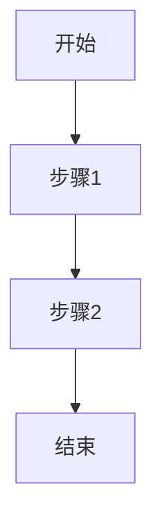
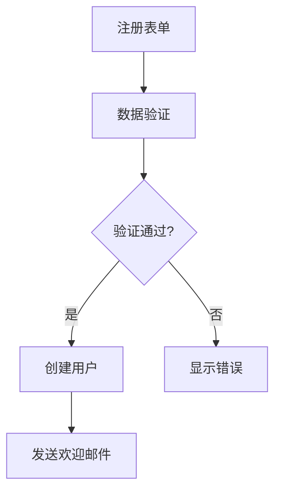

# 用户故事

## 基本信息
- **故事标题**：[标题]
- **创建日期**：[日期]
- **状态**：[未开始/进行中/已完成/已取消]
- **优先级**：[高/中/低]
- **预计工时**：[小时]
- **实际工时**：[小时]
- **负责人**：[姓名]

## 描述
### 用户故事
作为 [角色]，
我想要 [功能/行为]，
以便 [价值/目的]。

### 业务价值
[描述此故事为用户和业务带来的价值]

### 验收标准
1. [标准 1]
   - 给定 [前提条件]
   - 当 [触发动作]
   - 那么 [预期结果]

2. [标准 2]
   - 给定 [前提条件]
   - 当 [触发动作]
   - 那么 [预期结果]

## 技术实现
### 设计方案
[描述实现方案，可包含架构图、流程图等]

### 任务分解
1. [ ] [任务 1]
   - 预计时间：[小时]
   - 技术要点：[描述]
   - 完成标准：[描述]

2. [ ] [任务 2]
   - 预计时间：[小时]
   - 技术要点：[描述]
   - 完成标准：[描述]

### 测试计划
#### 单元测试
- [ ] [测试用例 1]
- [ ] [测试用例 2]

#### 集成测试
- [ ] [测试场景 1]
- [ ] [测试场景 2]

### 依赖关系
- 上游依赖：[故事/任务编号]
- 下游依赖：[故事/任务编号]

## 进度追踪
### 当前状态
[描述当前进展，遇到的问题和解决方案]

### 检查清单
- [ ] 设计方案已评审
- [ ] 代码已完成
- [ ] 单元测试已通过
- [ ] 集成测试已通过
- [ ] 文档已更新
- [ ] 代码已审查

## 注释和讨论
### 技术讨论
[记录重要的技术讨论和决策]

### 问题记录
[记录遇到的问题和解决方案]

## 示例
<example>
# 用户故事：实现用户注册功能

## 基本信息
- **故事标题**：用户注册功能实现
- **创建日期**：2024-03-21
- **状态**：进行中
- **优先级**：高
- **预计工时**：8
- **实际工时**：待定
- **负责人**：张三

## 描述
### 用户故事
作为一个潜在用户，
我想要能够注册一个新账户，
以便使用系统的所有功能。

### 业务价值
- 增加用户基数
- 收集用户数据
- 提供个性化服务

### 验收标准
1. 基本注册流程
   - 给定用户访问注册页面
   - 当填写必要信息并提交
   - 那么成功创建账户并跳转到首页

2. 数据验证
   - 给定用户提交无效数据
   - 当点击注册按钮
   - 那么显示适当的错误消息

## 技术实现
### 设计方案

### 任务分解
1. [ ] 创建注册表单
   - 预计时间：2小时
   - 技术要点：React Hook Form
   - 完成标准：表单验证完整

2. [ ] 实现后端 API
   - 预计时间：3小时
   - 技术要点：Express + MongoDB
   - 完成标准：API 测试通过
</example>

## 变更记录
| 日期 | 变更内容 | 作者 |
|------|----------|------|
| [日期] | [内容] | [作者] |
