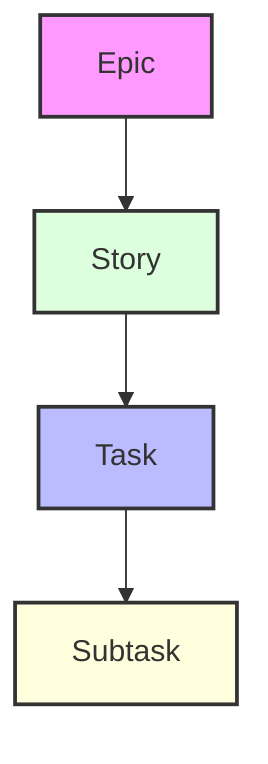
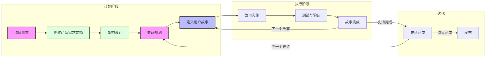

# Windsurf 敏捷工作流文档

本文档提供了与 Windsurf AI 能力集成的敏捷工作流系统的全面文档。该工作流旨在通过结构化的开发方法保持项目焦点并确保持续进展。

## 概述

Windsurf 敏捷工作流结合了传统敏捷方法和 AI 辅助开发，创造了一个强大而高效的开发流程。它可以通过两种主要方式利用：

1. **基于规则的实施**（自动）

   - 使用 `.windsurf/rules/` 模板
   - 自动将标准应用于匹配的文件
   - 提供一致的结构强制执行

2. **笔记本式实施**（灵活）
   - 使用 `xnotes/` 模板
   - 更轻量且更适应性强
   - 适合专注的开发会话

## 工作项层次结构



1. **Epics**

   - 大型、自包含的功能
   - 只能有一个活动的 Epic
   - 示例： "在线比赛系统"

2. **Stories**

   - 较小、可实施的工作单元
   - 必须属于一个 Epic
   - 示例： "用户资料创建"

3. **Tasks**

   - 技术实现步骤
   - 清晰的完成标准
   - 示例： "实现数据库架构"

4. **Subtasks**
   - 细粒度工作项
   - 经常包括测试要求
   - 示例： "编写单元测试"

## AI 项目计划和内存结构工作流将产生

```
.ai/
├── prd.md                 # 产品需求文档
├── arch.md               # 架构决策记录
├── epic-1/              # 当前 Epic 目录
│   ├── story-1.story.md  # Epic 1 的故事文件
│   ├── story-2.story.md
│   └── story-3.story.md
├── epic-2/              # 未来 Epic 目录
│   └── ...
└── epic-3/              # 未来史诗目录
    └── ...
```

## 工作流阶段

### 1. 计划阶段

- 专注于文档和规划
- 仅修改 `.ai/`、文档、README 和规则
- 需要对产品需求文档（PRD）和架构进行审批

### 2. 执行阶段

- 实施已批准的进行中故事
- 逐任务执行
- 持续测试和验证



## 实施指南

### 故事实施过程

1. **初始化**

   - 验证 `.ai` 目录是否存在
   - 定位已批准的架构和当前故事
   - 确保故事被正确标记为进行中

2. **开发流程**

   - 遵循测试驱动开发（TDD）
   - 定期更新任务/子任务状态
   - 记录所有实施笔记
   - 记录重要命令

3. **完成要求**
   - 所有测试必须通过
   - 文档必须更新
   - 用户必须批准完成

### 关键规则

> **关键规则：**
>
> - 永远不要在没有 PRD 和架构批准的情况下创建第一个故事
> - 只能有一个 Epic 同时进行
> - 只能有一个故事同时进行
> - 故事必须按照 PRD 指定的顺序实施
> - 永远不要在没有用户批准的情况下实施故事（标记为进行中的故事文件）

## 使用工作流

### 基于规则的方法

1. 安装工作流规则：

```bash
./apply-rules.sh /path/to/your/project
```

2. 使用提供的模板，将其复制到 `.windsurf/rules` 目录中：
   - `901-prd.mdc` 用于产品需求
   - `902-arch.mdc` 用于架构
   - `903-story.mdc` 用于故事

### 笔记本式方法

1. 启用 Windsurf 选项中的笔记本
2. 从模板创建笔记本：

   - `workflow-agile.md` 用于完整的工作流
   - `implementation-agile.md` 用于故事实施

3. 使用 `@notepad-name` 访问工作流上下文

> **提示：** 使用笔记本方法：
>
> - 初始项目设置（笔记本名称 plan-agile）
> - 故事实施（笔记本名称 impl-story）
> - 专注的开发会话
> - 减少上下文开销

- 新建上下文窗口示例命令： `@plan-agile 我有一个高级想法 <描述高级想法>`
- 新建上下文窗口示例命令： `@impl-story 我准备开始实施当前进行中的故事`

## 最佳实践

1. **文档**

   - AI 将保持 PRD 和架构文档更新 - 有时您需要告诉它更新 PRD 和架构文件。
   - 记录所有重要决策
   - 保持清晰的实施笔记

2. **测试**

   - 在实施之前编写测试
   - 保持高测试覆盖率
   - 在完成之前验证所有测试

3. **进度跟踪**

   - 定期更新故事状态
   - 记录所有实施笔记
   - 记录命令历史

4. **上下文管理**
   - 每个故事或在记录显著进度后启动新作曲家实例（记录在任务完成更新中）
   - 使用适当的上下文级别
   - 最小化上下文开销

## 状态进展

故事遵循严格的状态进展：

```
草稿 -> 进行中 -> 完成
```

史诗遵循类似的进展：

```
未来 -> 当前 -> 完成
```

## 与 Windsurf AI 集成

工作流旨在与 Windsurf 的 AI 能力无缝集成：

1. **AI 辅助规划**

   - AI 帮助创建和完善 PRD
   - AI 建议架构改进
   - AI 协助故事分解

2. **AI 辅助实施**

   - AI 实施故事任务
   - AI 维护测试覆盖率
   - AI 更新文档

3. **AI 辅助审查**
   - AI 验证完成标准
   - AI 建议改进
   - AI 维护一致性

## 成本节约

- 如果您有可用的 LLM（如 ChatGPT、Claude、Gemini 等），它们也非常适合生成初始 PRD 和架构，并真正迭代它们。
- 在 Windsurf 中，目前您可以使用 DeepSeek R1，例如，它似乎是免费的，也很好地更新 PRD 和架构 - 但我发现它比使用 Claude 跟随我想要的格式稍微不那么可靠 - 但更便宜，如果您尝试在 Windsurf 中执行所有规划。
